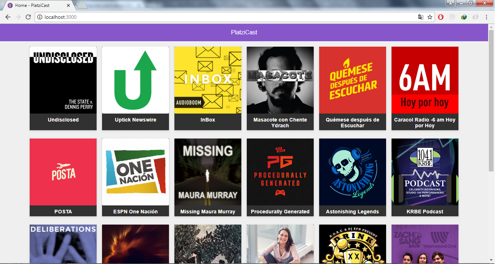
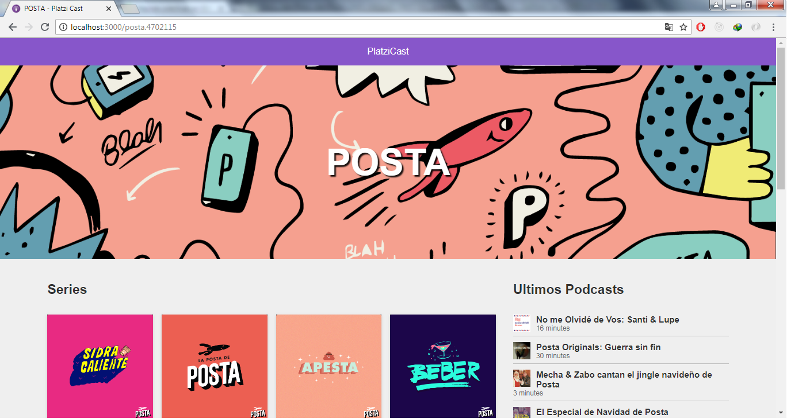
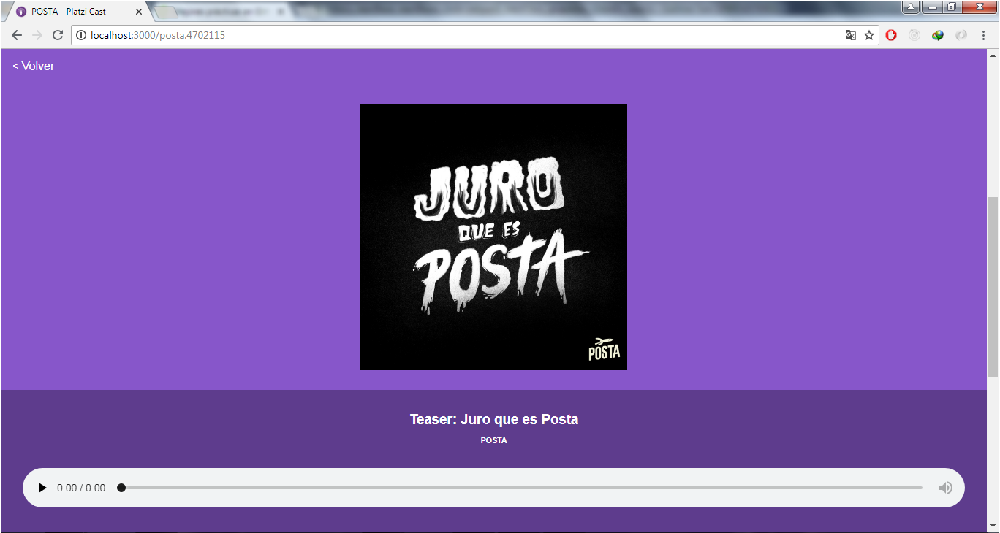

# App de Podcast de Platzi

App de podcast integrada con la API de AudioBoom para aprender Next.JS

## ¿Cómo debe usarce?

Requiere Node.JS 8.11.1

* `npm install` para instalar dependencias.
* `npm run dev` para el entorno de desarrollo.
* `npm run build && npm start` para el entorno de producción.

## Licencia

MIT